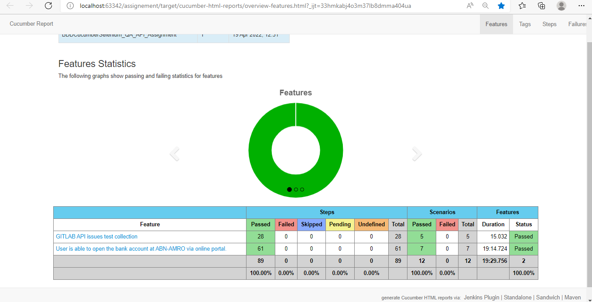
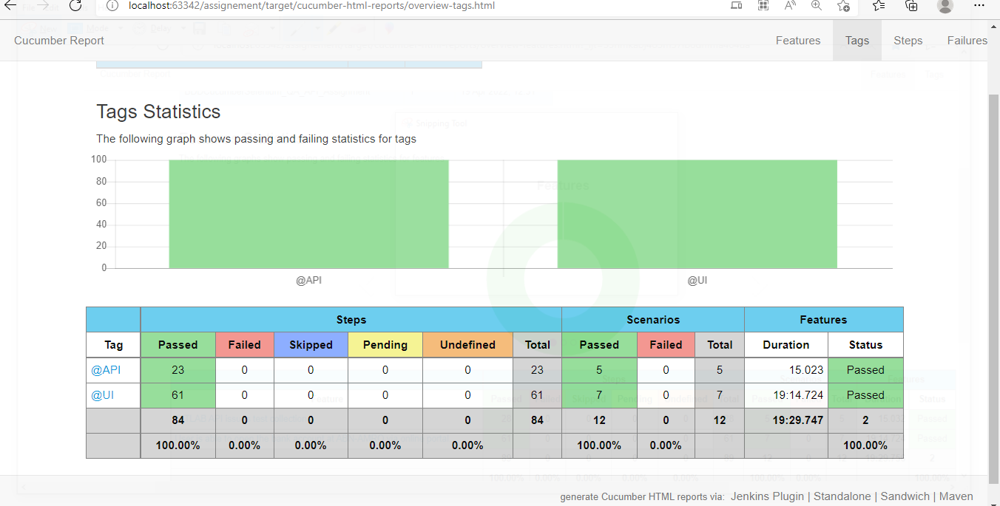

  
Author Name- Bahubali Gebise.

Framework : Web and API Test Automation project with Cucumber-BDD framework along with cucumber reporting.
  
** Project Details **

 * Please find below Automation Project basic information:
 
      A. Scenarios are written at .feature file under 'Feature' folder.
      
      B. StepDefinitions folder having all the methods from feature file.
      
      C. All methods logic has been implemented under "CoreLogic"[POM design pattern for UI scenarios].
      
      D. Web page operations logic added under "Util" folder and to pass Driver instance across testbaseClass created.
      
      E. Web scenarios : 
      
            - Added chromeDriver.exe/EgdeDriver.exe under resources folder - please check compatiable with your local browser version, else update driver under    "resources" folder. 
            - 
            - StepDefinitions files are having methods and its logic implemented in POM design pattern (Under 'CoreLogic' folder). 
            - Application is having 5 pages and from each page all object were added under respective page_names.java class.   
            - Some of input values for scenarios reading from environment.properties.
            - All WebElements operations logic added at "WebPageOperation.java" class under 'Util' folder.  
            
      F. API Scenarios :
      
            - StepDefinitions files are having methods and its logic implemented at "API_Implementation.java" class
            
            - POST and DELETE method API Urls read from environment.properties file.
            
            - Few input values are read from environment.properties.
            
            - Once Issue number has been deleted again on same deleted issue we can't trigger PUT method[update method].
            
   
    ***Note***: 
            - API testing - Private token value has been removed due to security concern.
            
            - Project ID: 35418729 [project created for gitlab issues API]
            
** Project Execution Steps**
 
  We can execute scenarios via Terminal(IDE- intellij) :
  
    - mvn clean test -Dcucumber.filter.tags="@API" -DapiToken="<apiTokenValue>"

    - mvn clean test -Dcucumber.filter.tags="@UI"

    - To run both Web and API sceanrios together then please use below command
        mvn clean test -Dcucumber.filter.tags="@UI or @API" -DapiToken="<apiTokenValue>"

    - and cucumber report will be created under target\cucumber-html-reports\overview-features.html
    - If report not updated under target folder then pleas right click on 'target' and click on 'load from Disk' option.

Please find below scenarios details :

1. Web Application UI scenarios :

|  TestCase   |                           **Web Scenarios Name**                                  |
|-------------|-----------------------------------------------------------------------------------|
|   UC01      |   HappyPath - As a retail user, I would like to open bank account                 |                   
|-------------|-----------------------------------------------------------------------------------|
|   UC02      |   As a retail user, I enter invalid address details and I am unable to open accoun|
--------------------------------------------------------------------------------------------------|
|   UC03      |    User able to navigate to previous page(Back Button functionality)              |
|-------------|-----------------------------------------------------------------------------------|
|   UC04      |    Business Account, verifies business bank account link text from UI             |
|-------------|-----------------------------------------------------------------------------------|
|   UC05      |    ToolTip functionality on Your_Details page                                     |
|-------------|-----------------------------------------------------------------------------------|
|   UC06      |   As a retail user, I enter invalid Email address and I am unable to open accoun  |
|-------------|-----------------------------------------------------------------------------------|
|   UC07      |  Validate telephone number and at Mandatory field NO blank value is allowed       |
|-------------|-----------------------------------------------------------------------------------|

2. GitLab API issues Scenarios :

|  TestCase   |                           **API Scenarios Name**                                  |
|-------------|-----------------------------------------------------------------------------------|
|   UC01      |   Fetch the newly created project details.                                        |                   
|-------------|-----------------------------------------------------------------------------------|
|   UC02      |   Create a issue on newly created project.                                        |
--------------------------------------------------------------------------------------------------|
|   UC03      |   Update a issue on newly created project                                         |
|-------------|-----------------------------------------------------------------------------------|
|   UC04      |  Delete an issue and confirm with GET method that issue was DELETED successfully  |
|-------------|-----------------------------------------------------------------------------------|
|   UC05      |    Update an issue, but the issue number is already deleted                       |
|-------------|-----------------------------------------------------------------------------------|

=================================================================================================
API and Web scenarios Execution Reports Screenshot:

below screenshot with Tags:

